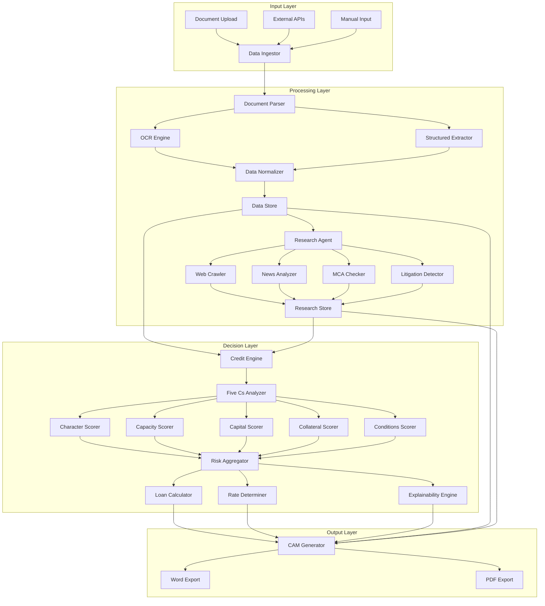

# Design Document: Intelli-Credit AI Corporate Credit Decisioning Engine

## Overview

Intelli-Credit is an AI-powered credit decisioning system that automates the preparation of Credit Appraisal Memos (CAMs) for Indian Banks and NBFCs. The system follows a pipeline architecture with four main components:

1. **Data Ingestor**: Multi-format document parsing and data extraction
2. **Research Agent**: Automated web intelligence gathering
3. **Credit Recommendation Engine**: Risk scoring and lending recommendations based on Five Cs framework
4. **CAM Generator**: Formatted report generation with audit trails

The system processes structured data (GST returns, ITR, bank statements), unstructured documents (PDFs, board minutes), and external sources (MCA filings, news, legal records) to produce explainable credit recommendations with supporting evidence.

## Architecture

### High-Level Architecture



### Component Interaction Flow

1. **Ingestion Phase**: Documents uploaded → Parsed → OCR applied if needed → Data extracted → Normalized → Stored
2. **Research Phase**: Company identified → Web research triggered → News/MCA/Legal data gathered → Sentiment analyzed → Stored
3. **Analysis Phase**: All data retrieved → Five Cs calculated → Risk score computed → Loan amount/rate determined → Explanations generated
4. **Generation Phase**: Template loaded → Data populated → Audit trail added → CAM formatted → Exported

### Technology Stack

- **Backend**: Python 3.10+
- **Data Processing**: pandas, numpy
- **Document Parsing**: pdfplumber, PyPDF2, python-docx
- **OCR**: pytesseract, pdf2image
- **Machine Learning**: scikit-learn, xgboost
- **Explainability**: shap, lime
- **LLM Integration**: OpenAI API / Llama via llama-cpp-python
- **Vector Search**: FAISS
- **Web Scraping**: BeautifulSoup4, Scrapy, requests
- **Storage**: PostgreSQL (structured data), AWS S3 (documents)
- **Frontend**: React 18, TypeScript, Tailwind CSS
- **API**: FastAPI

## Components and Interfaces

### 1. Data Ingestor Component

**Responsibilities**:
- Parse multiple document formats (PDF, Excel, CSV, images)
- Apply OCR to scanned documents
- Extract structured data using templates and ML models
- Validate and normalize extracted data
- Detect circular trading patterns
- Store processed data

**Interfaces**:

```python
class DocumentParser:
    def parse_pdf(file_path: str) -> Dict[str, Any]:
        """Parse PDF and extract text content"""
        
    def apply_ocr(image_data: bytes) -> str:
        """Apply OCR to scanned document images"""
        
    def extract_financial_data(document: Dict, doc_type: str) -> FinancialData:
        """Extract structured financial data based on document type"""

class DataExtractor:
    def extract_gst_returns(gst_data: Dict) -> GSTData:
        """Extract GST return information (GSTR-2A, GSTR-3B)"""
        
    def extract_itr(itr_data: Dict) -> ITRData:
        """Extract Income Tax Return data"""
        
    def extract_bank_statements(statement_data: Dict) -> List[Transaction]:
        """Extract bank transaction history"""
        
    def extract_annual_report(report_data: Dict) -> FinancialStatements:
        """Extract balance sheet, P&L, cash flow from annual reports"""

class CircularTradingDetector:
    def detect_circular_trading(gst_data: GSTData, bank_data: List[Transaction]) -> CircularTradingAlert:
        """Cross-check GST sales vs bank deposits to detect circular trading"""
        
    def compare_gstr_versions(gstr_2a: GSTData, gstr_3b: GSTData) -> List[Discrepancy]:
        """Compare GSTR-2A and GSTR-3B for mismatches"""

class DataNormalizer:
    def normalize_financial_data(raw_data: Dict, source_type: str) -> NormalizedData:
        """Convert various formats to unified schema"""
        
    def calculate_confidence_scores(extracted_data: Dict) -> Dict[str, float]:
        """Assign confidence scores to extracted fields"""
```

**Data Models**:

```python
@dataclass
class FinancialData:
    company_id: str
    period: str
    revenue: float
    expenses: float
    ebitda: float
    net_profit: float
    total_assets: float
    total_liabilities: float
    equity: float
    cash_flow: float
    confidence_scores: Dict[str, float]

@dataclass
class GSTData:
    gstin: str
    period: str
    sales: float
    purchases: float
    tax_paid: float
    transactions: List[Dict]

@dataclass
class Transaction:
    date: datetime
    description: str
    debit: float
    credit: float
    balance: float

@dataclass
class CircularTradingAlert:
    detected: bool
    severity: str  # "high", "medium", "low"
    discrepancies: List[str]
    gst_sales: float
    bank_deposits: float
    mismatch_percentage: float
```

### 2. Research Agent Component

**Responsibilities**:
- Crawl web sources for company intelligence
- Analyze news sentiment
- Check MCA compliance status
- Detect litigation from e-Courts
- Gather industry reports and RBI notifications
- Maintain source attribution

**Interfaces**:

```python
class WebCrawler:
    def search_company_news(company_name: str, days_back: int = 90) -> List[NewsArticle]:
        """Search news APIs for company mentions"""
        
    def fetch_mca_filings(cin: str) -> MCAData:
        """Retrieve MCA filings for company"""
        
    def search_ecourts(company_name: str, promoter_names: List[str]) -> List[LegalCase]:
        """Search e-Courts database for litigation"""
        
    def fetch_rbi_notifications(sector: str) -> List[RBINotification]:
        """Retrieve relevant RBI notifications"""

class SentimentAnalyzer:
    def analyze_news_sentiment(articles: List[NewsArticle]) -> SentimentScore:
        """Analyze sentiment of news articles"""
        
    def extract_key_events(articles: List[NewsArticle]) -> List[KeyEvent]:
        """Extract significant events from news"""

class ComplianceChecker:
    def check_mca_compliance(mca_data: MCAData) -> ComplianceStatus:
        """Verify MCA filing compliance"""
        
    def check_director_disqualification(directors: List[str]) -> List[DisqualificationRecord]:
        """Check if directors are disqualified"""
```

**Data Models**:

```python
@dataclass
class NewsArticle:
    title: str
    source: str
    url: str
    published_date: datetime
    content: str
    sentiment: str  # "positive", "neutral", "negative"

@dataclass
class MCAData:
    cin: str
    company_name: str
    registration_date: datetime
    directors: List[Dict]
    authorized_capital: float
    paid_up_capital: float
    last_filing_date: datetime
    compliance_status: str

@dataclass
class LegalCase:
    case_number: str
    court: str
    filing_date: datetime
    case_type: str
    status: str
    parties: List[str]
    summary: str

@dataclass
class SentimentScore:
    overall: float  # -1 to 1
    positive_count: int
    neutral_count: int
    negative_count: int
    key_themes: List[str]
```

### 3. Credit Recommendation Engine Component

**Responsibilities**:
- Calculate Five Cs scores (Character, Capacity, Capital, Collateral, Conditions)
- Compute financial ratios (DSCR, Debt/Equity, LTV)
- Aggregate risk score
- Determine maximum loan amount
- Calculate appropriate interest rate
- Generate explanations for all recommendations

**Interfaces**:

```python
class FiveCsAnalyzer:
    def analyze_character(promoter_data: Dict, legal_cases: List[LegalCase], 
                         credit_bureau: CIBILData) -> CharacterScore:
        """Assess promoter credibility"""
        
    def analyze_capacity(financial_data: FinancialData, debt_obligations: List[Debt]) -> CapacityScore:
        """Calculate DSCR and repayment ability"""
        
    def analyze_capital(financial_data: FinancialData) -> CapitalScore:
        """Evaluate equity strength and Debt/Equity ratio"""
        
    def analyze_collateral(collateral_assets: List[Asset], loan_amount: float) -> CollateralScore:
        """Calculate LTV and collateral adequacy"""
        
    def analyze_conditions(industry_data: Dict, rbi_notifications: List[RBINotification],
                          sentiment: SentimentScore) -> ConditionsScore:
        """Assess external risk factors"""

class RatioCalculator:
    def calculate_dscr(cash_flow: float, debt_service: float) -> float:
        """Calculate Debt Service Coverage Ratio"""
        
    def calculate_debt_equity_ratio(total_debt: float, total_equity: float) -> float:
        """Calculate Debt-to-Equity ratio"""
        
    def calculate_ltv(loan_amount: float, collateral_value: float) -> float:
        """Calculate Loan-to-Value ratio"""

class RiskAggregator:
    def calculate_composite_risk_score(five_cs: FiveCsScores, weights: Dict[str, float]) -> RiskScore:
        """Aggregate Five Cs into overall risk score"""
        
    def classify_risk_level(risk_score: float) -> str:
        """Classify as high/medium/low risk"""

class LoanCalculator:
    def calculate_max_loan_amount(ebitda: float, collateral_value: float, dscr: float) -> float:
        """Determine maximum recommended loan amount"""
        
    def determine_interest_rate(base_rate: float, risk_score: float) -> float:
        """Calculate interest rate with risk premium"""

class ExplainabilityEngine:
    def explain_risk_score(risk_score: RiskScore, five_cs: FiveCsScores) -> Explanation:
        """Generate explanation for risk score using SHAP values"""
        
    def explain_loan_amount(loan_amount: float, constraints: Dict) -> Explanation:
        """Explain which constraint limited the loan amount"""
        
    def explain_interest_rate(rate: float, risk_factors: List[str]) -> Explanation:
        """Explain interest rate components"""
```

**Data Models**:

```python
@dataclass
class CharacterScore:
    score: float  # 0-100
    litigation_count: int
    governance_rating: str
    credit_bureau_score: float
    negative_factors: List[str]

@dataclass
class CapacityScore:
    score: float  # 0-100
    dscr: float
    cash_flow: float
    debt_service: float
    trend: str  # "improving", "stable", "declining"

@dataclass
class CapitalScore:
    score: float  # 0-100
    debt_equity_ratio: float
    net_worth: float
    net_worth_trend: str

@dataclass
class CollateralScore:
    score: float  # 0-100
    ltv: float
    collateral_type: str
    valuation_date: datetime

@dataclass
class ConditionsScore:
    score: float  # 0-100
    sector_risk: str
    regulatory_risk: str
    commodity_risk: str
    risk_factors: List[str]

@dataclass
class FiveCsScores:
    character: CharacterScore
    capacity: CapacityScore
    capital: CapitalScore
    collateral: CollateralScore
    conditions: ConditionsScore

@dataclass
class RiskScore:
    overall_score: float  # 0-100
    risk_level: str  # "high", "medium", "low"
    top_risk_factors: List[str]
    top_positive_factors: List[str]

@dataclass
class LoanRecommendation:
    max_loan_amount: float
    recommended_interest_rate: float
    risk_score: RiskScore
    limiting_constraint: str
    explanations: Dict[str, Explanation]

@dataclass
class Explanation:
    summary: str
    key_factors: List[Tuple[str, float]]  # (factor_name, contribution)
    data_sources: List[str]
    reasoning: str
```

### 4. CAM Generator Component

**Responsibilities**:
- Generate formatted Credit Appraisal Memo
- Include all required sections
- Add audit trail
- Export to Word and PDF formats
- Maintain version history

**Interfaces**:

```python
class CAMGenerator:
    def generate_cam(company_data: Dict, financial_data: FinancialData,
                    research_data: Dict, loan_recommendation: LoanRecommendation,
                    audit_trail: AuditTrail) -> CAMDocument:
        """Generate complete CAM document"""
        
    def generate_executive_summary(loan_recommendation: LoanRecommendation) -> str:
        """Create executive summary section"""
        
    def generate_company_overview(company_data: Dict, mca_data: MCAData) -> str:
        """Create company overview section"""
        
    def generate_industry_analysis(industry_data: Dict, conditions_score: ConditionsScore) -> str:
        """Create industry analysis section"""
        
    def generate_financial_analysis(financial_data: FinancialData, ratios: Dict) -> str:
        """Create financial analysis section"""
        
    def generate_risk_assessment(risk_score: RiskScore, five_cs: FiveCsScores) -> str:
        """Create risk assessment section"""
        
    def generate_five_cs_summary(five_cs: FiveCsScores) -> str:
        """Create Five Cs summary section"""
        
    def generate_final_recommendation(loan_recommendation: LoanRecommendation) -> str:
        """Create final recommendation section"""
        
    def add_explainability_notes(explanations: Dict[str, Explanation]) -> str:
        """Add explainability notes section"""
        
    def add_audit_trail(audit_trail: AuditTrail) -> str:
        """Add audit trail section"""

class DocumentExporter:
    def export_to_word(cam_document: CAMDocument, output_path: str) -> None:
        """Export CAM to Word format"""
        
    def export_to_pdf(cam_document: CAMDocument, output_path: str) -> None:
        """Export CAM to PDF format"""

class AuditTrailManager:
    def record_data_ingestion(source: str, timestamp: datetime, method: str) -> None:
        """Record data ingestion event"""
        
    def record_research_activity(url: str, timestamp: datetime, data_retrieved: str) -> None:
        """Record research activity"""
        
    def record_calculation(calculation_type: str, formula: str, inputs: Dict, output: float) -> None:
        """Record calculation details"""
        
    def record_modification(user: str, field: str, old_value: Any, new_value: Any, timestamp: datetime) -> None:
        """Record data modification"""
```

**Data Models**:

```python
@dataclass
class CAMDocument:
    application_id: str
    company_name: str
    generated_date: datetime
    sections: Dict[str, str]
    audit_trail: AuditTrail
    version: int

@dataclass
class AuditTrail:
    events: List[AuditEvent]
    
@dataclass
class AuditEvent:
    timestamp: datetime
    event_type: str
    description: str
    user: Optional[str]
    data: Dict[str, Any]
```

## Data Models

### Core Domain Models

```python
@dataclass
class LoanApplication:
    application_id: str
    company_id: str
    company_name: str
    cin: str
    gstin: str
    loan_amount_requested: float
    loan_purpose: str
    submitted_date: datetime
    status: str
    documents: List[Document]

@dataclass
class Document:
    document_id: str
    document_type: str  # "GST", "ITR", "BankStatement", "AnnualReport", etc.
    file_path: str
    upload_date: datetime
    processed: bool
    confidence_score: float
    extracted_data: Dict[str, Any]

@dataclass
class Company:
    company_id: str
    cin: str
    gstin: str
    name: str
    industry: str
    incorporation_date: datetime
    promoters: List[Promoter]
    
@dataclass
class Promoter:
    name: str
    din: str  # Director Identification Number
    shareholding: float
    role: str

@dataclass
class Debt:
    lender: str
    amount: float
    interest_rate: float
    emi: float
    outstanding: float
    
@dataclass
class Asset:
    asset_type: str
    description: str
    value: float
    valuation_date: datetime
```

### Database Schema

**PostgreSQL Tables**:

```sql
-- Applications table
CREATE TABLE applications (
    application_id UUID PRIMARY KEY,
    company_id UUID NOT NULL,
    loan_amount_requested DECIMAL(15,2),
    loan_purpose TEXT,
    submitted_date TIMESTAMP,
    status VARCHAR(50),
    created_at TIMESTAMP DEFAULT NOW()
);

-- Companies table
CREATE TABLE companies (
    company_id UUID PRIMARY KEY,
    cin VARCHAR(21) UNIQUE,
    gstin VARCHAR(15),
    name VARCHAR(255),
    industry VARCHAR(100),
    incorporation_date DATE,
    created_at TIMESTAMP DEFAULT NOW()
);

-- Financial data table
CREATE TABLE financial_data (
    id UUID PRIMARY KEY,
    company_id UUID REFERENCES companies(company_id),
    period VARCHAR(20),
    revenue DECIMAL(15,2),
    expenses DECIMAL(15,2),
    ebitda DECIMAL(15,2),
    net_profit DECIMAL(15,2),
    total_assets DECIMAL(15,2),
    total_liabilities DECIMAL(15,2),
    equity DECIMAL(15,2),
    cash_flow DECIMAL(15,2),
    created_at TIMESTAMP DEFAULT NOW()
);

-- Research data table
CREATE TABLE research_data (
    id UUID PRIMARY KEY,
    company_id UUID REFERENCES companies(company_id),
    data_type VARCHAR(50),  -- "news", "mca", "legal", "rbi"
    source_url TEXT,
    content JSONB,
    sentiment VARCHAR(20),
    retrieved_at TIMESTAMP,
    created_at TIMESTAMP DEFAULT NOW()
);

-- Credit assessments table
CREATE TABLE credit_assessments (
    id UUID PRIMARY KEY,
    application_id UUID REFERENCES applications(application_id),
    risk_score DECIMAL(5,2),
    risk_level VARCHAR(20),
    character_score DECIMAL(5,2),
    capacity_score DECIMAL(5,2),
    capital_score DECIMAL(5,2),
    collateral_score DECIMAL(5,2),
    conditions_score DECIMAL(5,2),
    max_loan_amount DECIMAL(15,2),
    recommended_rate DECIMAL(5,2),
    created_at TIMESTAMP DEFAULT NOW()
);

-- Audit trail table
CREATE TABLE audit_trail (
    id UUID PRIMARY KEY,
    application_id UUID REFERENCES applications(application_id),
    event_type VARCHAR(50),
    description TEXT,
    user_id UUID,
    event_data JSONB,
    timestamp TIMESTAMP DEFAULT NOW()
);
```

## Correctness Properties

*A property is a characteristic or behavior that should hold true across all valid executions of a system—essentially, a formal statement about what the system should do. Properties serve as the bridge between human-readable specifications and machine-verifiable correctness guarantees.*

### Property Reflection

After analyzing all acceptance criteria, several properties can be consolidated:

- **Score range properties (5.4, 6.4, 7.4, 8.4, 9.4, 10.1)**: All Five Cs scores and the composite risk score must be 0-100. These can be combined into a single property about score validity.
- **Threshold classification properties (10.3, 10.4, 10.5)**: Risk level classification based on score ranges. These are edge cases that will be handled by generators.
- **Interest rate premium properties (12.2, 12.3, 12.4)**: Risk premium ranges based on risk score. These are edge cases that will be handled by generators.
- **Documentation properties (5.5, 7.5, 8.5, 9.5, 12.5, 13.4)**: Multiple properties about documenting factors and components. These can be combined into properties about explanation completeness.
- **Audit trail properties (15.1, 15.2, 15.3, 15.5)**: Multiple properties about recording different types of events. These can be combined into a single property about audit trail completeness.
- **Extraction properties (1.1-1.6)**: Multiple properties about extracting data from different document types. These can be combined into a general extraction property.

### Core Properties

Property 1: Document Data Extraction Completeness
*For any* valid financial document (GST return, ITR, bank statement, annual report, board minutes, rating report), when parsed by the Data_Ingestor, all required fields for that document type should be extracted and present in the output.
**Validates: Requirements 1.1, 1.2, 1.3, 1.4, 1.6**

Property 2: OCR Application for Scanned Documents
*For any* scanned document uploaded to the system, the Data_Ingestor should apply OCR processing before attempting data extraction.
**Validates: Requirements 1.5**

Property 3: Extraction Accuracy Threshold
*For any* document processed by the Data_Ingestor, the field extraction accuracy should meet or exceed 85% when compared to ground truth data.
**Validates: Requirements 1.7, 17.1, 17.2**

Property 4: External Data Source Integration
*For any* company identifier provided, the Data_Ingestor should successfully retrieve data from all configured external sources (MCA filings, news articles, e-Courts legal records).
**Validates: Requirements 2.1, 2.2, 2.3**

Property 5: Manual Input Association
*For any* site visit notes added by a Credit Officer, the notes should be stored and correctly associated with the corresponding loan application.
**Validates: Requirements 2.4**

Property 6: Data Normalization
*For any* set of ingested data from multiple sources, the Data_Ingestor should normalize all data into a unified schema before storage.
**Validates: Requirements 2.5**

Property 7: Circular Trading Detection via Cross-Check
*For any* loan application with both GST sales data and bank deposit data, the Data_Ingestor should perform a cross-check comparison between the two data sources.
**Validates: Requirements 3.1**

Property 8: GSTR Mismatch Detection
*For any* loan application with both GSTR-2A and GSTR-3B data, when a significant mismatch exists between the two forms, the Data_Ingestor should flag the application for circular trading risk.
**Validates: Requirements 3.2**

Property 9: Circular Trading Alert Generation
*For any* detected circular trading indicator, the system should generate an alert containing specific discrepancies and amounts.
**Validates: Requirements 3.3**

Property 10: High-Risk Deposit Ratio Flagging
*For any* loan application where bank deposits are less than 70% of reported GST sales, the system should mark this as a high-risk indicator.
**Validates: Requirements 3.4**

Property 11: Research Source Attribution
*For any* research data gathered by the Research_Agent, the data should include source URLs and timestamps.
**Validates: Requirements 4.1, 4.2, 4.3, 4.4, 4.5, 4.6**

Property 12: Sentiment Classification
*For any* news article analyzed by the Research_Agent, the sentiment should be classified as exactly one of: positive, neutral, or negative.
**Validates: Requirements 4.2**

Property 13: Five Cs Score Validity
*For any* completed Five Cs assessment (Character, Capacity, Capital, Collateral, Conditions) and composite risk score, all scores should be within the range 0 to 100 inclusive.
**Validates: Requirements 5.4, 6.4, 7.4, 8.4, 9.4, 10.1**

Property 14: Character Assessment Data Sources
*For any* Character assessment, the Credit_Engine should check litigation history, governance records, and credit bureau data.
**Validates: Requirements 5.1, 5.2, 5.3**

Property 15: DSCR Calculation Formula
*For any* financial data with cash flow and debt service values, the calculated DSCR should equal cash flow divided by debt service.
**Validates: Requirements 6.1**

Property 16: DSCR Threshold Flagging
*For any* loan application where DSCR is below 1.25, the system should flag the application as having insufficient repayment capacity.
**Validates: Requirements 6.2**

Property 17: Capacity Score Breakdown
*For any* calculated DSCR, the system should provide a breakdown showing cash flow components and debt obligations.
**Validates: Requirements 6.5**

Property 18: Debt-to-Equity Calculation
*For any* balance sheet data with total debt and total equity values, the calculated Debt-to-Equity ratio should equal total debt divided by total equity.
**Validates: Requirements 7.1**

Property 19: Debt-to-Equity Threshold Flagging
*For any* loan application where Debt-to-Equity ratio exceeds 2.0, the system should flag the application as having weak capital structure.
**Validates: Requirements 7.2**

Property 20: Net Worth Trend Analysis
*For any* capital evaluation with financial data spanning three years, the system should analyze and report net worth trends over that period.
**Validates: Requirements 7.3**

Property 21: LTV Calculation Formula
*For any* collateral information with loan amount and collateral value, the calculated LTV should equal loan amount divided by collateral value.
**Validates: Requirements 8.1**

Property 22: LTV Threshold Flagging
*For any* loan application where LTV exceeds 0.75, the system should flag the application as having insufficient collateral coverage.
**Validates: Requirements 8.2**

Property 23: Aggregate LTV Calculation
*For any* loan application with multiple collateral assets, the system should calculate an aggregate LTV across all assets.
**Validates: Requirements 8.3**

Property 24: Weighted Risk Score Calculation
*For any* completed Five Cs assessment with configured weights, the composite risk score should be calculated as the weighted sum of the five individual scores.
**Validates: Requirements 10.2**

Property 25: Maximum Loan Amount Calculation
*For any* financial data with EBITDA value, the initial maximum loan amount should be calculated as 0.4 multiplied by EBITDA.
**Validates: Requirements 11.1**

Property 26: Collateral-Based Loan Cap
*For any* loan calculation where collateral value is lower than the EBITDA-based loan amount, the recommended loan amount should be capped at 75% of collateral value.
**Validates: Requirements 11.2**

Property 27: DSCR-Based Loan Reduction
*For any* loan calculation where DSCR is below 1.25, the recommended loan amount should be reduced proportionally from the initial calculation.
**Validates: Requirements 11.3**

Property 28: Loan Amount Calculation Breakdown
*For any* calculated loan amount, the system should provide a breakdown of the calculation methodology.
**Validates: Requirements 11.4**

Property 29: Most Conservative Constraint Application
*For any* loan calculation with multiple limiting factors (EBITDA, collateral, DSCR), the system should apply the most conservative (lowest) constraint as the final recommendation.
**Validates: Requirements 11.5**

Property 30: Interest Rate Formula
*For any* calculated risk score, the determined interest rate should equal base rate plus risk premium.
**Validates: Requirements 12.1**

Property 31: Recommendation Explanation Completeness
*For any* generated credit recommendation, the system should provide explanations for all decision components (risk score, loan amount, interest rate).
**Validates: Requirements 13.1**

Property 32: Top Risk Factors Identification
*For any* risk score explanation, the system should identify exactly three top factors contributing to the score.
**Validates: Requirements 13.2**

Property 33: Limiting Constraint Identification
*For any* loan amount explanation, the system should identify which constraint was the limiting factor.
**Validates: Requirements 13.3**

Property 34: Explanation Source Citation
*For any* generated explanation, all data points should be cited with their specific sources.
**Validates: Requirements 13.5**

Property 35: CAM Section Completeness
*For any* generated CAM document, it should contain all eight required sections: Executive Summary, Company Overview, Industry Analysis, Financial Analysis, Risk Assessment, Five Cs Summary, Final Recommendation, and Explainability Notes.
**Validates: Requirements 14.1, 14.2**

Property 36: CAM Export Format Support
*For any* created CAM document, the system should successfully export it to both Word and PDF formats.
**Validates: Requirements 14.3**

Property 37: Audit Trail Completeness
*For any* system operation (data ingestion, research, calculation, modification), the audit trail should record the event with source/URL, timestamp, user (if applicable), and operation details.
**Validates: Requirements 15.1, 15.2, 15.3, 15.4, 15.5**

Property 38: Financial Ratio Calculation Set
*For any* financial statements provided, the Credit_Engine should calculate all three core ratios: DSCR, Debt-to-Equity, and LTV.
**Validates: Requirements 16.1**

Property 39: Accounting Period Consistency
*For any* set of ratio calculations, all ratios should use the same consistent accounting period.
**Validates: Requirements 16.2**

Property 40: Industry Benchmark Comparison
*For any* calculated financial ratios, the system should compare them against industry benchmarks.
**Validates: Requirements 16.3**

Property 41: Three-Year Trend Calculation
*For any* ratio trend analysis, the system should calculate year-over-year changes for the past three years.
**Validates: Requirements 16.4**

Property 42: Out-of-Range Ratio Flagging
*For any* calculated ratio that falls outside acceptable ranges, the system should flag it with a severity indicator.
**Validates: Requirements 16.5**

Property 43: Low Confidence Field Flagging
*For any* extracted field with confidence score below 70%, the system should flag the field for manual review.
**Validates: Requirements 17.3**

Property 44: Confidence Score Provision
*For any* completed document parsing, the system should provide a confidence score for each extracted field.
**Validates: Requirements 17.4**

Property 45: GST Format Parsing
*For any* GST return document in GSTR-2A or GSTR-3B format, the Data_Ingestor should correctly parse and extract all transaction data.
**Validates: Requirements 18.1**

Property 46: MCA Filing Extraction
*For any* MCA filing document, the Data_Ingestor should extract company registration details, director information, and financial filings.
**Validates: Requirements 18.2**

Property 47: CIBIL API Integration
*For any* credit history check, the Credit_Engine should integrate with and retrieve data from CIBIL commercial credit bureau APIs.
**Validates: Requirements 18.3**

Property 48: Indian Accounting Standards Compliance
*For any* financial ratio calculation, the Credit_Engine should follow Indian Accounting Standards (Ind AS) rules.
**Validates: Requirements 18.4**

Property 49: End-to-End Workflow Automation
*For any* uploaded company annual report, the system should automatically trigger the complete workflow: data extraction → research → Five Cs scoring → CAM generation, without manual intervention.
**Validates: Requirements 19.1, 19.2, 19.3, 19.4**

Property 50: Workflow Completion Time
*For any* complete workflow execution from initial upload to final CAM presentation, the total time should not exceed 5 minutes.
**Validates: Requirements 19.5**

## Error Handling

### Error Categories

1. **Document Processing Errors**
   - Invalid file format
   - Corrupted PDF
   - OCR failure on low-quality scans
   - Missing required fields in structured documents

2. **External API Errors**
   - MCA API unavailable
   - News API rate limit exceeded
   - e-Courts database timeout
   - CIBIL API authentication failure

3. **Data Validation Errors**
   - Negative financial values where positive expected
   - Missing required fields for calculations
   - Inconsistent date ranges
   - Invalid company identifiers (CIN, GSTIN)

4. **Calculation Errors**
   - Division by zero in ratio calculations
   - Missing input data for formulas
   - Constraint conflicts in loan amount determination

5. **Export Errors**
   - Template file not found
   - Insufficient disk space for export
   - Permission errors writing output files

### Error Handling Strategies

**Graceful Degradation**:
- If OCR fails, flag document for manual entry but continue processing other documents
- If one external API fails, continue with available data and note missing sources in CAM
- If optional data is missing, proceed with available data and document limitations

**Retry Logic**:
- External API calls: 3 retries with exponential backoff
- Database operations: 2 retries with 1-second delay
- File operations: 2 retries

**User Notification**:
- All errors logged to audit trail
- Critical errors displayed to Credit Officer with actionable messages
- Warnings for low-confidence extractions
- Missing data highlighted in generated CAM

**Fallback Values**:
- If industry benchmarks unavailable, use system-wide defaults
- If sentiment analysis fails, classify as "neutral"
- If DSCR cannot be calculated, use alternative capacity metrics

**Validation Rules**:
- All financial values must be non-negative
- Dates must be in valid ranges (not future dates for historical data)
- Ratios must have non-zero denominators
- Scores must be in 0-100 range

## Testing Strategy

### Dual Testing Approach

The Intelli-Credit system requires both unit testing and property-based testing for comprehensive coverage:

- **Unit tests**: Verify specific examples, edge cases, and error conditions
- **Property tests**: Verify universal properties across all inputs

Both testing approaches are complementary and necessary. Unit tests catch concrete bugs in specific scenarios, while property tests verify general correctness across a wide range of inputs.

### Unit Testing Focus

Unit tests should focus on:
- Specific examples that demonstrate correct behavior (e.g., parsing a known GST return)
- Integration points between components (e.g., Data Ingestor → Credit Engine)
- Edge cases and error conditions (e.g., division by zero, missing fields)
- External API mocking and error scenarios

Avoid writing too many unit tests for scenarios that property-based tests can cover through randomization.

### Property-Based Testing Configuration

**Library Selection**: Use Hypothesis for Python (backend) and fast-check for TypeScript (frontend)

**Test Configuration**:
- Minimum 100 iterations per property test (due to randomization)
- Each property test must reference its design document property
- Tag format: `# Feature: intelli-credit, Property {number}: {property_text}`

**Example Property Test Structure**:

```python
from hypothesis import given, strategies as st
import pytest

# Feature: intelli-credit, Property 15: DSCR Calculation Formula
@given(
    cash_flow=st.floats(min_value=0.01, max_value=1e9),
    debt_service=st.floats(min_value=0.01, max_value=1e9)
)
def test_dscr_calculation_formula(cash_flow, debt_service):
    """For any financial data with cash flow and debt service values,
    the calculated DSCR should equal cash flow divided by debt service."""
    
    financial_data = FinancialData(cash_flow=cash_flow, debt_service=debt_service)
    calculator = RatioCalculator()
    
    calculated_dscr = calculator.calculate_dscr(cash_flow, debt_service)
    expected_dscr = cash_flow / debt_service
    
    assert abs(calculated_dscr - expected_dscr) < 0.001  # Allow for floating point precision
```

**Generator Strategies**:
- Financial data: Generate realistic ranges (revenue 1M-1B, ratios 0.1-10)
- Documents: Generate valid document structures with random but realistic data
- Dates: Generate dates within reasonable business ranges (past 10 years)
- Text: Generate company names, descriptions with realistic character sets
- Edge cases: Ensure generators include boundary values (zero, very large numbers)

**Property Test Coverage**:
- All 50 correctness properties must have corresponding property tests
- Each property test should run minimum 100 iterations
- Property tests should use realistic data generators
- Edge cases (thresholds, classifications) should be covered by generator strategies

### Integration Testing

- End-to-end workflow tests from document upload to CAM generation
- External API integration tests (with mocked responses)
- Database integration tests
- Export functionality tests (Word/PDF generation)

### Performance Testing

- Document processing time benchmarks
- End-to-end workflow completion time (target: < 5 minutes)
- Concurrent user load testing
- Large document handling (100+ page PDFs)

### Test Data

- Synthetic financial documents with known ground truth
- Anonymized real documents (with PII removed)
- Edge case documents (poor scan quality, unusual formats)
- Invalid documents for error handling tests
